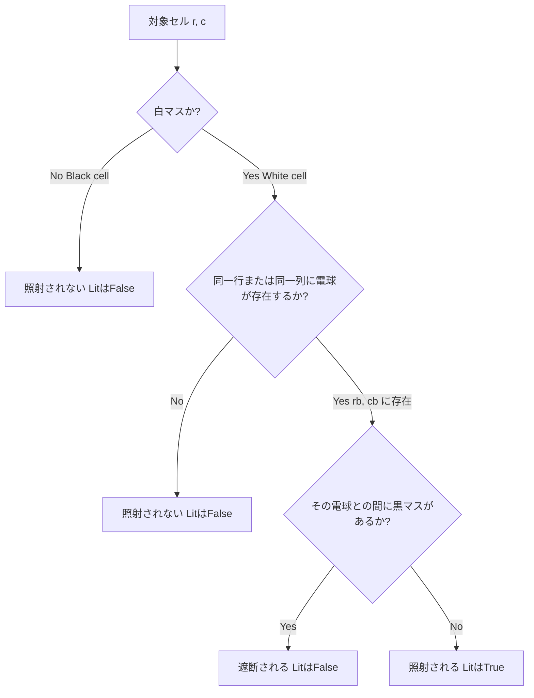

# 美術館パズル（Akari / Light Up）の一階述語論理による厳密仕様設計書

本設計書は、ペンシルパズル「美術館（Akari / Light Up）」のすべてのルール、クリア判定条件、および違反状態を、数学的に厳密な**一階述語論理（First-Order Logic: FOL）**を用いて定義します。

本仕様は、パズルエンジンの判定ロジックの実装、SATソルバー（Z3等）を用いた自動解法プログラムの作成、および形式検証の基礎として機能します。

---

## 1. 盤面の表現（Board Representation）

盤面は、有限の格子状グリッドとして表現されます。

### 1.1 座標系と境界の定義
盤面の高さを $H \in \mathbb{N}^+$（縦のセル数）、幅を $W \in \mathbb{N}^+$（横のセル数）とします。

* **セル（座標）の集合 $Cell$**:
  $$Cell = \{ (r, c) \mid r, c \in \mathbb{N}^+ \wedge 1 \le r \le H \wedge 1 \le c \le W \}$$
  ここで、$r$ は行番号（Row）、$c$ は列番号（Column）を表します。

* **範囲内判定述語 $InBounds(r, c)$**:
  $$(r, c) \in Cell$$

### 1.2 セル型の定義
盤面上の各セルは「白マス」または「黒マス」のいずれか一方に分類され、一部の黒マスには数字（0〜4）が割り当てられます。これらを表すために以下の述語を定義します。

* **白マス述語 $White(r, c)$**:
  セル $(r, c)$ が白マス（電球を置くことができ、照らされる必要があるマス）であることを示します。

* **黒マス述語 $Black(r, c)$**:
  セル $(r, c)$ が黒マス（電球を置くことができず、光を遮るマス）であることを示します。

* **数字付き黒マス述語 $BlackNum(r, c, n)$**:
  セル $(r, c)$ が数字 $n \in \{0, 1, 2, 3, 4\}$ の書かれた黒マスであることを示します。

#### 盤面の整合性公理（Consistency Axioms）
盤面が正しく構成されるために、以下の公理が満たされる必要があります。

1. **白マスと黒マスの排他性**:
   すべてのセルは白マスまたは黒マスのいずれか一方のみであり、両方であることはない。
   $$\forall r \forall c \, (InBounds(r, c) \Rightarrow (White(r, c) \oplus Black(r, c)))$$
   > ※ $\oplus$ は排他的論理和（Exclusive OR）を表し、$(White \wedge \neg Black) \vee (\neg White \wedge Black)$ と同値です。

2. **数字付き黒マスの前提**:
   数字付き黒マスは、黒マスでなければならない。
   $$\forall r \forall c \forall n \, (BlackNum(r, c, n) \Rightarrow Black(r, c))$$

3. **数字の一意性**:
   1つの黒マスに対して、割り当てられる数字は高々1つである。
   $$\forall r \forall c \forall n_1 \forall n_2 \, ((BlackNum(r, c, n_1) \wedge BlackNum(r, c, n_2)) \Rightarrow n_1 = n_2)$$

---

## 2. 電球の配置状態（Light Bulb Placement）

プレイヤーが盤面に配置する電球の状態を定義します。

* **電球配置述語 $Bulb(r, c)$**:
  セル $(r, c)$ に電球が配置されていることを示します。

### 2.1 電球の配置可能条件
電球は白マスにのみ配置できます（黒マスや盤面外には配置できません）。
$$\forall r \forall c \, (Bulb(r, c) \Rightarrow White(r, c))$$

---

## 3. 電球によるセルの照射条件（Illumination）

電球から放たれる光の到達性と、セルが照らされている状態を定義します。

### 3.1 光の到達性 $Reach(r_1, c_1, r_2, c_2)$
セル $(r_1, c_1)$ と セル $(r_2, c_2)$ の間で、光が遮られずに到達できることを示す四項関係です。光は縦または横に直進し、黒マスによって遮られます。

$$
Reach(r_1, c_1, r_2, c_2) \Leftrightarrow InBounds(r_1, c_1) \wedge InBounds(r_2, c_2) \wedge 
\begin{pmatrix}
  \big( r_1 = r_2 \wedge c_1 = c_2 \wedge White(r_1, c_1) \big) \\
  \vee \\
  \big( r_1 = r_2 \wedge c_1 \neq c_2 \wedge \forall c' (\min(c_1, c_2) \le c' \le \max(c_1, c_2) \Rightarrow White(r_1, c')) \big) \\
  \vee \\
  \big( c_1 = c_2 \wedge r_1 \neq r_2 \wedge \forall r' (\min(r_1, r_2) \le r' \le \max(r_1, r_2) \Rightarrow White(r', c_1)) \big)
\end{pmatrix}
$$

> [!NOTE]
> この定義では、始点・終点・およびその間にあるすべてのセルが「白マス」であること（すなわち黒マスが存在しないこと）を保証しています。これにより、黒マスによって光が遮られるルールが厳密に表現されます。

### 3.2 照射述語 $Lit(r, c)$
セル $(r, c)$ が「電球によって照らされている」状態を定義します。電球が置かれたセル自体も照らされているとみなされます。

$$Lit(r, c) \Leftrightarrow \exists r_b \exists c_b \, (Bulb(r_b, c_b) \wedge Reach(r_b, c_b, r, c))$$

---

## 4. ルール制約の論理式定義（Constraints）

美術館パズルを解くうえで遵守しなければならない2つの中心的制約です。

### 4.1 電球同士の衝突回避制約（No Bulb-to-Bulb Illumination）
電球はお互いを照らし合ってはなりません。すなわち、ある電球から別の電球へ光が届く経路が存在してはなりません。

$$\forall r_1 \forall c_1 \forall r_2 \forall c_2 \, \Big( \big( Bulb(r_1, c_1) \wedge Bulb(r_2, c_2) \wedge (r_1 \neq r_2 \vee c_1 \neq c_2) \big) \Rightarrow \neg Reach(r_1, c_1, r_2, c_2) \Big)$$

### 4.2 数字付き黒マスの制約（Adjacent Bulb Count Constraints）
数字付き黒マスに隣接する4マス（上下左右）に配置される電球の総数は、その黒マスの数字と一致しなければなりません。

まず、2つのセルが**隣接関係**にあることを示す述語 $Adj(r_1, c_1, r_2, c_2)$ を定義します。
$$Adj(r_1, c_1, r_2, c_2) \Leftrightarrow InBounds(r_1, c_1) \wedge InBounds(r_2, c_2) \wedge (|r_1 - r_2| + |c_1 - c_2| = 1)$$

各数字 $n \in \{0, 1, 2, 3, 4\}$ に対して、隣接する電球の数を指定する述語 $CountBulbs(r, c, n)$ を一階述語論理で以下のように定義します。

#### $n = 0$ の場合（電球が0個）
隣接するどのセルにも電球が存在しない。
$$CountBulbs(r, c, 0) \Leftrightarrow \forall r_1 \forall c_1 \, (Adj(r, c, r_1, c_1) \Rightarrow \neg Bulb(r_1, c_1))$$

#### $n = 1$ の場合（電球が1個）
隣接するセルの中に電球がちょうど1つ存在する。
$$
CountBulbs(r, c, 1) \Leftrightarrow \exists r_1 \exists c_1 \, \Big( Adj(r, c, r_1, c_1) \wedge Bulb(r_1, c_1) \wedge \forall r_2 \forall c_2 \, \big( (Adj(r, c, r_2, c_2) \wedge Bulb(r_2, c_2)) \Rightarrow (r_1 = r_2 \wedge c_1 = c_2) \big) \Big)
$$

#### $n = 2$ の場合（電球が2個）
隣接するセルの中に相異なる電球がちょうど2つ存在する。
$$
CountBulbs(r, c, 2) \Leftrightarrow \exists r_1 \exists c_1 \exists r_2 \exists c_2 \, \begin{pmatrix}
  Adj(r, c, r_1, c_1) \wedge Bulb(r_1, c_1) \\
  \wedge \\
  Adj(r, c, r_2, c_2) \wedge Bulb(r_2, c_2) \\
  \wedge \\
  (r_1 \neq r_2 \vee c_1 \neq c_2) \\
  \wedge \\
  \forall r_3 \forall c_3 \, \Big( (Adj(r, c, r_3, c_3) \wedge Bulb(r_3, c_3)) \Rightarrow (r_3 = r_1 \wedge c_3 = c_1) \vee (r_3 = r_2 \wedge c_3 = c_2) \Big)
\end{pmatrix}
$$

#### $n = 3$ の場合（電球が3個）
隣接するセルの中に相異なる電球がちょうど3つ存在する。
$$
CountBulbs(r, c, 3) \Leftrightarrow \exists r_1 \exists c_1 \exists r_2 \exists c_2 \exists r_3 \exists c_3 \, \begin{pmatrix}
  Adj(r, c, r_1, c_1) \wedge Bulb(r_1, c_1) \\
  \wedge \\
  Adj(r, c, r_2, c_2) \wedge Bulb(r_2, c_2) \\
  \wedge \\
  Adj(r, c, r_3, c_3) \wedge Bulb(r_3, c_3) \\
  \wedge \\
  (r_1 \neq r_2 \vee c_1 \neq c_2) \wedge (r_1 \neq r_3 \vee c_1 \neq c_3) \wedge (r_2 \neq r_3 \vee c_2 \neq c_3) \\
  \wedge \\
  \forall r_4 \forall c_4 \, \Big( (Adj(r, c, r_4, c_4) \wedge Bulb(r_4, c_4)) \Rightarrow \bigvee_{i=1}^3 (r_4 = r_i \wedge c_4 = c_i) \Big)
\end{pmatrix}
$$

#### $n = 4$ の場合（電球が4個）
隣接するセルの中に相異なる電球がちょうど4つ存在する。
$$
CountBulbs(r, c, 4) \Leftrightarrow \exists r_1 \exists c_1 \exists r_2 \exists c_2 \exists r_3 \exists c_3 \exists r_4 \exists c_4 \, \begin{pmatrix}
  \bigwedge_{i=1}^4 \big( Adj(r, c, r_i, c_i) \wedge Bulb(r_i, c_i) \big) \\
  \wedge \\
  \bigwedge_{1 \le i < j \le 4} (r_i \neq r_j \vee c_i \neq c_j) \\
  \wedge \\
  \forall r_5 \forall c_5 \, \Big( (Adj(r, c, r_5, c_5) \wedge Bulb(r_5, c_5)) \Rightarrow \bigvee_{i=1}^4 (r_5 = r_i \wedge c_5 = c_i) \Big)
\end{pmatrix}
$$

#### 数字付き黒マス制約の全称論理式
すべての数字付き黒マスについて、上記で定義した個数一致の条件を満たさなければなりません。
$$\forall r \forall c \forall n \, \big( BlackNum(r, c, n) \Rightarrow CountBulbs(r, c, n) \big)$$

---

## 5. クリア判定条件（Win Condition）

パズルが「クリア（解決）」された状態を定義します。クリア判定 $Solved$ は、電球が正しく配置され、かつすべての白マスが照射され、どのルールにも違反していない状態を意味します。

$$
Solved \Leftrightarrow
\begin{pmatrix}
  \forall r \forall c \, (Bulb(r, c) \Rightarrow White(r, c)) & \text{ (電球の白マス配置ルール)} \\
  \wedge & \\
  \forall r_1 \forall c_1 \forall r_2 \forall c_2 \, \Big( \big( Bulb(r_1, c_1) \wedge Bulb(r_2, c_2) \wedge (r_1 \neq r_2 \vee c_1 \neq c_2) \big) \Rightarrow \neg Reach(r_1, c_1, r_2, c_2) \Big) & \text{ (電球同士の衝突回避)} \\
  \wedge & \\
  \forall r \forall c \forall n \, \big( BlackNum(r, c, n) \Rightarrow CountBulbs(r, c, n) \big) & \text{ (数字付き黒マス制約の遵守)} \\
  \wedge & \\
  \forall r \forall c \, (White(r, c) \Rightarrow Lit(r, c)) & \text{ (全白マスの照射完了)}
\end{pmatrix}
$$

---

## 6. 違反状態（Violation States）

パズルのプレイ中に「違反（Error）」と判定される状態を定義します。これは上記の制約条件の否定（存在否定）をとることで導出され、UI上でのエラー強調表示や検証器の実装に利用されます。

### 6.1 配置違反 $ViolatePlacement$
電球が黒マス（または盤面外）に配置されている状態。
$$ViolatePlacement \Leftrightarrow \exists r \exists c \, (Bulb(r, c) \wedge \neg White(r, c))$$

### 6.2 衝突違反 $ViolateCollision$
2つの電球が互いを照らし合っている状態。
$$ViolateCollision \Leftrightarrow \exists r_1 \exists c_1 \exists r_2 \exists c_2 \, (Bulb(r_1, c_1) \wedge Bulb(r_2, c_2) \wedge (r_1 \neq r_2 \vee c_1 \neq c_2) \wedge Reach(r_1, c_1, r_2, c_2))$$

### 6.3 数字制約違反 $ViolateNumber$
数字付き黒マスの隣接電球数が、数字と一致しない状態。
$$ViolateNumber \Leftrightarrow \exists r \exists c \exists n \, (BlackNum(r, c, n) \wedge \neg CountBulbs(r, c, n))$$

### 6.4 未照射違反 $ViolateUnlit$
まだ照らされていない白マスが存在する状態（※パズルの「未完了」状態を示しますが、他の制約違反とは異なり即座にゲームオーバーとなる違反ではありません）。
$$ViolateUnlit \Leftrightarrow \exists r \exists c \, (White(r, c) \wedge \neg Lit(r, c))$$

---

## 7. 適用例：3x3 盤面での検証

具体例として、以下の簡単な $3 \times 3$ 盤面を用いて仕様の適合性を検証します。

### 7.1 盤面設定
* 白マス: $(1, 1), (1, 2), (1, 3), (2, 1), (2, 3), (3, 1), (3, 2), (3, 3)$
* 数字「1」付き黒マス: $(2, 2)$
* 盤面の事前定義（定数）:
  * $White(r, c)$ は $(2, 2)$ を除くすべてのセルで $True$
  * $Black(2, 2)$ は $True$
  * $BlackNum(2, 2, 1)$ は $True$

### 7.2 電球の配置例
プレイヤーがセル $(1, 2)$ とセル $(3, 1)$ に電球を配置したと仮定します。
* $Bulb(1, 2) = True$
* $Bulb(3, 1) = True$
* それ以外のすべてのセル $(r, c)$ に対して $Bulb(r, c) = False$

### 7.3 ルールおよびクリアの評価

1. **電球の配置可能条件**:
   $Bulb(1, 2) \Rightarrow White(1, 2)$（$True \Rightarrow True$ なので成立）
   $Bulb(3, 1) \Rightarrow White(3, 1)$（$True \Rightarrow True$ なので成立）
   配置違反なし。

2. **電球の衝突回避**:
   $(1, 2)$ と $(3, 1)$ の衝突について：
   $r_1 = 1, c_1 = 2$ と $r_2 = 3, c_2 = 1$ は行も列も異なるため、定義より $Reach(1, 2, 3, 1) = False$。
   したがって、$\neg Reach(1, 2, 3, 1) = True$ となり衝突回避制約を満たします。

3. **数字付き黒マスの制約 ($BlackNum(2, 2, 1)$)**:
   $(2, 2)$ に隣接するセルは $(1, 2), (3, 2), (2, 1), (2, 3)$ の4つ。
   このうち、電球があるのは $(1, 2)$ の1つだけです。
   したがって、隣接する電球の数は $1$ となり、$CountBulbs(2, 2, 1)$ が成立します。

4. **全白マスの照射完了**:
   各白マスに対する $Lit(r, c)$ の評価：
   * $(1, 1)$: $Reach(1, 2, 1, 1)$ が成立し、$(1, 2)$ に電球があるため $Lit(1, 1) = True$。
   * $(1, 2)$: 電球自体があるため $Lit(1, 2) = True$。
   * $(1, 3)$: $Reach(1, 2, 1, 3)$ が成立し、$(1, 2)$ に電球があるため $Lit(1, 3) = True$。
   * $(2, 1)$: $Reach(3, 1, 2, 1)$ が成立し、$(3, 1)$ に電球があるため $Lit(2, 1) = True$。
   * $(3, 1)$: 電球自体があるため $Lit(3, 1) = True$。
   * $(3, 2)$: $Reach(3, 1, 3, 2)$ が成立し、$(3, 1)$ に電球があるため $Lit(3, 2) = True$。
   * $(3, 3)$: $Reach(3, 1, 3, 3)$ が成立し、$(3, 1)$ に電球があるため $Lit(3, 3) = True$。
   * $(2, 3)$: どの電球からも到達不可能（$(1, 2)$ からは列が異なり、$(3, 1)$ からは行が異なる。また、黒マス $(2, 2)$ が間を遮断している）。したがって $Lit(2, 3) = False$。

**結論**: $\forall r \forall c (White(r, c) \Rightarrow Lit(r, c))$ が偽（$(2, 3)$ が未照射）となるため、$Solved = False$ と判定され、まだクリア状態ではありません。この場合、$(2, 3)$ またはそれに光を届けるセル（例：$(1, 3)$ など）に電球を追加配置する必要があります。
