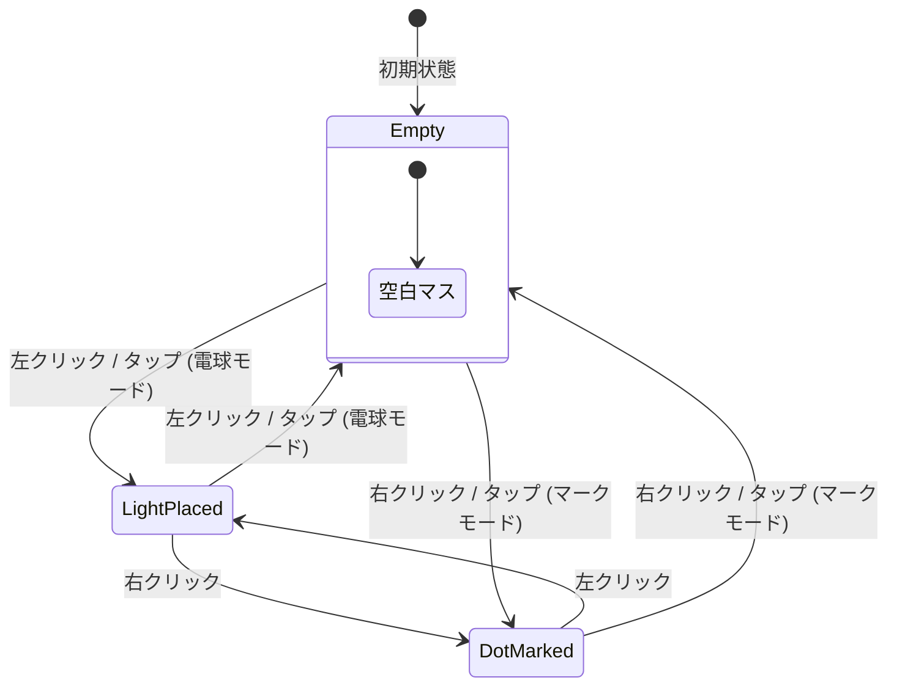

# 美術館パズル（Akari/Light Up） Webアプリ詳細設計書
本ドキュメントは、「美術館パズル（別名：美術品展示室、Akari、Light Up）」をブラウザ上で快適かつ美しくプレイするためのWebアプリケーションにおける画面設計、ユーザー操作設計、およびスタイリングガイド（CSS仕様）を定義します。

---

## 1. デザインコンセプト：夜の美術館 (Night Museum)

美術館パズルは、盤面に「電球」を配置してすべての通路を照らすパズルゲームです。本作では、プレイヤーが**「夜閉館した後の静寂な美術館で、美術品を照らす照明技師（キュレーター）」**になったかのような体験を提供するため、**「ダークテーマ × 温かみのある電球色 × アートフレーム（額縁）のような上品な装飾」**をコアコンセプトとします。

### 1.1. カラーパレット (Color Palette)
全体的に明度を抑え、光のネオンエフェクトやグラデーションが最も映える色彩設計とします。

| 役割 | 色名 | カラーコード (HEX / HSL) | 用途・視覚効果 |
| :--- | :--- | :--- | :--- |
| **背景（ベース）** | Obsidian Black | `#0f0f12` / `hsl(240, 10%, 7%)` | 画面全体の最背面。静寂な夜の美術館を表現。 |
| **サーフェス（パネル）** | Gallery Slate | `#1a1a24` / `hsl(240, 16%, 12%)` | 盤面背景や操作パネルの背景。若干の青みを帯びたダークグレー。 |
| **メインアクセント（光）** | Museum Amber | `#ffc73b` / `hsl(43, 100%, 62%)` | 電球の光、照らされたセルのネオンイエロー。温かみのある白熱灯。 |
| **セカンダリ（額縁）** | Antique Gold | `#c5a880` / `hsl(35, 38%, 64%)` | 額縁の金属パーツを模したゴールド。境界線や重要テキストに使用。 |
| **エラー表示** | Neon Crimson | `#ff3860` / `hsl(348, 100%, 61%)` | ルール違反（電球同士の衝突、数字不一致）を警告する赤色光。 |
| **マーク（目印）** | Cobalt Dust | `#4f5b66` / `hsl(210, 13%, 36%)` | ドットや×印（電球を置かない目印）の控えめなグレー。 |

### 1.2. タイポグラフィ (Typography)
- **フォントファミリー（欧文・数字）**: `'Cinzel', 'Playfair Display', serif`
  - 美術館のクラシカルで格式高い雰囲気を醸し出すため、見出しやレベル選択、タイマーなどの数字にはセリフ体（明朝体系）を採用。
- **フォントファミリー（日本語・本文）**: `'Noto Sans JP', 'Inter', sans-serif`
  - UIのラベルや設定テキストなど、視認性が重視される部分には現代的なサンセリフ体を使用。

### 1.3. アート表現（テクスチャ・装飾）
- **ボーダー装飾**: 盤面やパネルの枠線には、単なる直線ではなく、二重線や `Antique Gold` の細いグラデーションを用い、「額縁（Art Frame）」のような高級感を持たせます。
- **背景ノイズ**: 画面全体に微細なスモークやグレイン（粒子）効果を重ね、インダストリアルな美術館の壁面質感を表現します。

---

## 2. 画面レイアウト構成 (Screen Layout & Responsive)

パズルに集中できるよう、無駄な要素を削ぎ落としたシンメトリーな1カラム構成とします。

### 2.1. ワイヤーフレーム構造 (SPA構成)

```
+-------------------------------------------------------------+
|                        Header                               |
|        [ Logo: AKARI MUSEUM ]   [ Rule (Icon) ]             |
+-------------------------------------------------------------+
|                                                             |
|   1. Control Panel                                          |
|      +---------------------------------------------------+  |
|      | Level: [ Easy (5x5) ] [ Normal (7x7) ] [ Hard (10x10) ] |  |
|      | Timer: 02:45   |  Remaining Lights: 4/12          |  |
|      +---------------------------------------------------+  |
|                                                             |
|   2. Puzzle Board (Responsive Grid)                         |
|      +---------------------------------------------------+  |
|      |  [ ]  [#]  [.]  [ ]  [ ]                          |  |
|      |  [ ]  [1]  [L]=======L=====> (光の拡散)            |  |
|      |  [.]  [ ]  [#]  [ ]  [.]                          |  |
|      |  [ ]  [ ]  [ ]  [2]  [ ]                          |  |
|      +---------------------------------------------------+  |
|                                                             |
|   3. Tool Bar / Controls                                    |
|      +---------------------------------------------------+  |
|      | [ Toggle Mode (Light/Dot) ] [ Reset ] [ Give Up ] |  |
|      +---------------------------------------------------+  |
|                                                             |
+-------------------------------------------------------------+
| Footer: © 2026 Akari Museum Project                         |
+-------------------------------------------------------------+
```

### 2.2. レスポンシブグリッドデザイン (CSS Grid Layout)
- 盤面は CSS Grid (`grid-template-columns: repeat(N, 1fr)`) を用いて構築し、アスペクト比 `1:1` を維持します。
- 画面サイズ（特にスマートフォンなどの縦画面）に合わせて盤面の最大幅を制限します (`max-width: 90vh` または `90vw` の小さい方)。
- コンテナクエリ (`@container`) やメディアクエリ (`@media`) を駆使し、セル内のテキスト（黒マスの数字など）やアイコンサイズが動的に縮小・拡大するように設計します。

---

## 3. ユーザー操作設計 (Interaction Design)

マウスとタッチデバイス双方で、直感的かつ誤操作のない操作体験（UX）を提供します。

### 3.1. デバイス別操作マッピング

| アクション | PC（マウス） | モバイル（タッチ） |
| :--- | :--- | :--- |
| **電球の配置 / 解除** | **左クリック** | **タップ**（電球モード時）※デフォルト |
| **マーク（×・ドット）の配置 / 解除** | **右クリック** (コンテキストメニュー抑止) | **タップ**（マークモード時）または **長押し** (300ms) |
| **操作モードの切り替え** | ショートカットキー `Space` または `M` | **トグルボタン**（画面下部のフローティングツールバー） |

> [!NOTE]
> モバイル環境では右クリックに相当する操作が難しいため、画面下部に「電球配置モード」と「マーク配置モード」をワンタップで切り替えるトグルボタンを常設します。また、現在どちらのモードであるかを視覚的（カーソルデザインやボタンのネオン発光）に明確化します。

### 3.2. セルの状態遷移
各セル（白マス）は、ユーザーの操作によって以下のように循環的に状態が遷移します。



---

## 4. 盤面セルの状態表現 (Cell Visual Specifications)

パズルの視覚的フィードバックは、グリッドの表現力が鍵となります。

| セル種別 | 視覚表現・デザイン |
| :--- | :--- |
| **空白セル (Empty)** | わずかに青みのある極暗グレー背景。隣接セルとの境界は極細 of `hsl(240, 10%, 20%)` ボーダー。 |
| **黒マス (Wall/Black Cell)** | 大理石またはコンクリート質感の完全な黒に近い背景。ゴールドまたはシルバーの境界線。 |
| **数字付き黒マス (Numbered)** | 黒マスの中央に、上品なセリフ体フォントで `0, 1, 2, 3, 4` を表示。ルールをクリアしている場合は控えめな白、未達成はゴールド、超過（エラー）時はネオンレッドに発光。 |
| **電球セル (Light bulb)** | セル中央にクラシックな電球のSVGフィラメントアイコンを配置。電球自体が強いゴールド/イエローの光を放つ。 |
| **照らされたセル (Illuminated)** | 電球から直線状に伸びる光が通過するマス。中心に近いほど明るく、端にいくほど減衰するようなグラデーションオーバーレイを重ね、光の軌跡を表現。 |
| **マークセル (Dot/Cross)** | セル中央に小さな「真鍮製の鋲（ドット）」または控えめな「×」マークを表示。光の邪魔をしないように透過度を高めに設定。 |
| **エラーセル (Error/Conflict)** | 電球同士が照らし合っている線上のセル、および該当する電球。または数字の条件を満たしていない黒マス。 |

---

## 5. スタイリングガイド & CSS仕様 (Styling Guide & CSS)

「夜の美術館」テーマを構築するためのCSSカスタムプロパティおよびクラス定義の仕様です。

### 5.1. CSSカスタムプロパティ (Variables)

```css
:root {
  /* 基礎カラー */
  --color-bg-base: hsl(240, 10%, 7%);
  --color-bg-panel: hsl(240, 16%, 12%);
  --color-cell-empty: hsl(240, 12%, 15%);
  --color-cell-wall: hsl(240, 8%, 5%);
  
  /* 光・装飾カラー */
  --color-amber-glow: hsl(43, 100%, 62%);
  --color-gold-metallic: hsl(35, 38%, 64%);
  --color-neon-crimson: hsl(348, 100%, 61%);
  --color-dot-marker: hsl(210, 13%, 36%);
  
  /* 影とネオンエフェクト */
  --shadow-neon-amber: 0 0 15px hsla(43, 100%, 62%, 0.6), 
                        0 0 30px hsla(43, 100%, 62%, 0.3);
  --shadow-neon-red: 0 0 15px hsla(348, 100%, 61%, 0.7), 
                      0 0 30px hsla(348, 100%, 61%, 0.4);
  --border-gold-frame: 1px solid var(--color-gold-metallic);
  
  /* トランジション */
  --transition-smooth: all 0.3s cubic-bezier(0.25, 0.8, 0.25, 1);
  --transition-fast: all 0.15s ease;
}
```

### 5.2. セルの基礎＆黒マス設計

```css
/* 盤面グリッドコンテナ */
.museum-board {
  display: grid;
  aspect-ratio: 1 / 1;
  background-color: var(--color-cell-wall);
  border: 4px double var(--color-gold-metallic);
  box-shadow: 0 20px 50px rgba(0, 0, 0, 0.8);
  border-radius: 4px;
  overflow: hidden;
  padding: 2px;
  gap: 2px; /* セル間の隙間をグリッドギャップで表現 */
}

/* 共通セル */
.board-cell {
  position: relative;
  aspect-ratio: 1 / 1;
  display: flex;
  align-items: center;
  justify-content: center;
  user-select: none;
  cursor: pointer;
  transition: var(--transition-fast);
}

/* 空白セル */
.board-cell.cell-empty {
  background-color: var(--color-cell-empty);
}
.board-cell.cell-empty:hover {
  background-color: hsl(240, 12%, 20%);
}

/* 壁・黒マス */
.board-cell.cell-wall {
  background: radial-gradient(circle at center, #15151a 0%, var(--color-cell-wall) 100%);
  color: hsl(0, 0%, 60%);
  font-family: 'Cinzel', serif;
  font-size: 1.5rem;
  font-weight: bold;
  box-shadow: inset 0 0 10px rgba(0,0,0,0.9);
  cursor: not-allowed;
}

/* 壁（クリア状態）: 隣接電球数が一致しているとき */
.board-cell.cell-wall.wall-satisfied {
  color: var(--color-gold-metallic);
  text-shadow: 0 0 5px hsla(35, 38%, 64%, 0.5);
}
```

### 5.3. 光の表現（電球と照射光）

電球が置かれたセルと、そこから広がる光の表現には `box-shadow` と擬似要素による光線グラデーションを用います。

```css
/* 電球が置かれたセル */
.board-cell.cell-lightbulb {
  background-color: var(--color-cell-empty);
}

/* 電球SVGアイコンの配置と発光 */
.board-cell.cell-lightbulb::before {
  content: '';
  width: 60%;
  height: 60%;
  background-image: url("data:image/svg+xml;utf8,<svg xmlns='http://www.w3.org/2000/svg' viewBox='0 0 24 24' fill='%23ffc73b'><path d='M12 2C7.86 2 4.5 5.36 4.5 9.5c0 2.52 1.24 4.75 3.13 6.13C8.82 16.5 9.5 17.58 9.5 19h5c0-1.42.68-2.5 1.87-3.37C18.26 14.25 19.5 12.02 19.5 9.5 19.5 5.36 16.14 2 12 2zm-1 20h2v1h-2z'/></svg>");
  background-repeat: no-repeat;
  background-position: center;
  filter: drop-shadow(0 0 8px var(--color-amber-glow));
  animation: bulb-appear 0.25s cubic-bezier(0.175, 0.885, 0.32, 1.275) forwards;
  z-index: 2;
}

/* 照らされたセル */
.board-cell.cell-illuminated {
  background-color: hsla(43, 100%, 62%, 0.15); /* ほのかな黄色のオーバーレイ */
  transition: background-color 0.4s ease;
}

/* 光の到達感（電球ソースからの距離によるグラデーションをJS等で細かく制御しない場合の、CSSでの簡易フォールバック） */
.board-cell.cell-illuminated::after {
  content: '';
  position: absolute;
  top: 0; left: 0; right: 0; bottom: 0;
  box-shadow: inset 0 0 15px hsla(43, 100%, 62%, 0.05);
  pointer-events: none;
}
```

### 5.4. マーク（ドット）の表現

```css
.board-cell.cell-marked::before {
  content: '';
  width: 8px;
  height: 8px;
  border-radius: 50%;
  background-color: var(--color-dot-marker);
  box-shadow: 0 1px 3px rgba(0,0,0,0.5), inset 0 1px 1px rgba(255,255,255,0.2);
  animation: dot-appear 0.15s ease-out forwards;
}

/* モード切替時のカーソル変更 */
.museum-board.mode-lightbulb .board-cell.cell-empty {
  cursor: url("data:image/svg+xml;utf8,<svg xmlns='http://www.w3.org/2000/svg' width='24' height='24' viewBox='0 0 24 24' fill='%23ffc73b'><path d='M12 2C7.86 2 4.5 5.36 4.5 9.5c0 2.52 1.24 4.75 3.13 6.13C8.82 16.5 9.5 17.58 9.5 19h5c0-1.42.68-2.5 1.87-3.37C18.26 14.25 19.5 12.02 19.5 9.5 19.5 5.36 16.14 2 12 2z'/></svg>") 12 12, pointer;
}
.museum-board.mode-dot .board-cell.cell-empty {
  cursor: url("data:image/svg+xml;utf8,<svg xmlns='http://www.w3.org/2000/svg' width='16' height='16' viewBox='0 0 16 16'><circle cx='8' cy='8' r='4' fill='%234f5b66'/></svg>") 8 8, pointer;
}
```

---

## 6. エラー視覚表示 (Error & Warning Visuals)

パズルルールに対する違反が発生した際、プレイヤーへ即座に「何が間違っているか」を伝えるアニメーション警告です。

### 6.1. 電球同士の衝突 (Light bulb Conflict)
同じ列または行に遮るもの（黒マス）がなく、2つ以上の電球が照らし合っている状態。

- **表現**: 該当する電球セル全体、およびその間を結ぶ照射ラインが**「赤色の警告ネオン」**に染まります。
- **CSS設計**:

```css
/* エラー状態の電球 */
.board-cell.cell-lightbulb.status-error::before {
  filter: drop-shadow(0 0 10px var(--color-neon-crimson));
  background-image: url("data:image/svg+xml;utf8,<svg xmlns='http://www.w3.org/2000/svg' viewBox='0 0 24 24' fill='%23ff3860'><path d='M12 2C7.86 2 4.5 5.36 4.5 9.5c0 2.52 1.24 4.75 3.13 6.13C8.82 16.5 9.5 17.58 9.5 19h5c0-1.42.68-2.5 1.87-3.37C18.26 14.25 19.5 12.02 19.5 9.5 19.5 5.36 16.14 2 12 2zm-1 20h2v1h-2z'/></svg>");
  animation: error-shiver 0.15s infinite alternate; /* 微振動アニメーション */
}

/* エラー状態の光線 */
.board-cell.cell-illuminated.status-error {
  background-color: hsla(348, 100%, 61%, 0.2); /* 赤ネオンの透過 */
}
```

### 6.2. 黒マスの数字オーバー (Wall Number Overflow)
黒マスの周囲4マスに配置された電球の数が、黒マスに書かれた数字を超えてしまっている状態。

- **表現**: 黒マスの数字自体が赤く激しく明滅し、黒マスの外周に赤い光の輪が表示されます。
- **CSS設計**:

```css
.board-cell.cell-wall.wall-error {
  color: var(--color-neon-crimson);
  text-shadow: var(--shadow-neon-red);
  box-shadow: inset 0 0 10px rgba(0,0,0,0.9), 0 0 10px hsla(348, 100%, 61%, 0.4);
  border: 1px solid var(--color-neon-crimson);
  animation: error-pulse 1.5s infinite ease-in-out;
}
```

---

## 7. クリア時のお祝い演出 (Game Clear Celebrations)

ゲームをクリアした瞬間、静かだった美術館が「華やかにライトアップ」される演出を行い、強い達成感を与えます。

### 7.1. 演出フェーズ
1. **フェーズ1：館内ライトアップ (Museum Illuminating)**
   盤面全体のグリッド線が一瞬強くゴールドに発光し、すべての照らされたセルが最も美しいゴールデンイエロー (`var(--color-amber-glow)`) に無段階で明るくなります。
2. **フェーズ2：ゴールドの紙吹雪 (Golden Confetti)**
   キャンバス（Canvas API）またはCSSアニメーションにより、画面上部からアンティークゴールドとシャンパンゴールドの紙吹雪がランダムに舞い落ちます。
3. **フェーズ3：アールデコ調クリアモーダルの出現**
   額縁（フレーム）をあしらった上品なモーダルウィンドウが中央にフェードインし、クリアタイム、最小手数などのスコアを表示します。

### 7.2. クリア時CSSアニメーションコード

```css
/* 盤面全体がクリア時に行う発光アニメーション */
.museum-board.clear-animation {
  animation: board-gold-glow 2s cubic-bezier(0.25, 1, 0.5, 1) forwards;
}

@keyframes board-gold-glow {
  0% {
    border-color: var(--color-gold-metallic);
    box-shadow: 0 20px 50px rgba(0, 0, 0, 0.8);
  }
  30% {
    border-color: var(--color-amber-glow);
    box-shadow: 0 0 30px var(--color-amber-glow), 0 20px 50px rgba(0, 0, 0, 0.9);
  }
  100% {
    border-color: var(--color-gold-metallic);
    box-shadow: 0 0 15px hsla(43, 100%, 62%, 0.3), 0 20px 50px rgba(0, 0, 0, 0.8);
  }
}
```

---

## 8. プリセット問題構成 (Presets & Game Levels)

すぐに遊べるように、難易度別に異なる盤面サイズと黒マスの配置（対称的で美しいデザインのもの）をプリセットとして定義します。

### 8.1. Easy 難易度 (5x5)
- **特徴**: ルール理解に最適。中央対称のシンプルな配置。
- **データ構造**:
  - `.` = 空白マス
  - 数字 = 数字付き黒マス
  - `#` = 数字なし黒マス

```json
[
  [".", "1", ".", ".", "."],
  [".", ".", ".", "#", "."],
  [".", "#", "2", "#", "."],
  [".", "#", ".", ".", "."],
  [".", ".", ".", "0", "."]
]
```

### 8.2. Normal 難易度 (7x7)
- **特徴**: 程よい難度で、電球同士が照らし合わないよう考える戦略が必要となる標準サイズ。

```json
[
  [".", ".", "#", ".", "1", ".", "."],
  [".", ".", ".", ".", ".", ".", "."],
  ["#", ".", "2", ".", "0", ".", "#"],
  [".", ".", ".", ".", ".", ".", "."],
  ["#", ".", "1", ".", "2", ".", "#"],
  [".", ".", ".", ".", ".", ".", "."],
  [".", ".", "0", ".", "#", ".", "."]
]
```

### 8.3. Hard 難易度 (10x10)
- **特徴**: 空白マスが多く、背反的な論理的思考が求められる美術館の最大展示室。

```json
[
  [".", ".", ".", ".", "#", ".", ".", ".", ".", "."],
  [".", "2", ".", ".", ".", ".", "1", ".", "0", "."],
  [".", ".", ".", ".", ".", ".", ".", ".", ".", "."],
  [".", ".", ".", "1", ".", ".", "2", ".", ".", "."],
  ["#", ".", ".", ".", ".", ".", ".", ".", ".", "1"],
  ["1", ".", ".", ".", ".", ".", ".", ".", ".", "#"],
  [".", ".", ".", "2", ".", ".", "1", ".", ".", "."],
  [".", ".", ".", ".", ".", ".", ".", ".", ".", "."],
  [".", "0", ".", "2", ".", ".", ".", ".", "1", "."],
  [".", ".", ".", ".", ".", "#", ".", ".", ".", "."]
]
```

---

## 9. インタラクション・フィードバック・アニメーション一覧

本ゲームで使用するトランジションおよびアニメーション効果を定義します。

### 9.1. アニメーションCSS一覧

```css
/* 電球の出現アニメーション (Pop-in) */
@keyframes bulb-appear {
  0% {
    transform: scale(0);
    opacity: 0;
  }
  70% {
    transform: scale(1.15);
  }
  100% {
    transform: scale(1);
    opacity: 1;
  }
}

/* マーク（ドット）の出現アニメーション (Fade-in-scale) */
@keyframes dot-appear {
  0% {
    transform: scale(0.5);
    opacity: 0;
  }
  100% {
    transform: scale(1);
    opacity: 0.8;
  }
}

/* エラー時の微振動 (Shiver) */
@keyframes error-shiver {
  0% { transform: translate(1px, 1px) rotate(0deg); }
  10% { transform: translate(-1px, -2px) rotate(-1deg); }
  20% { transform: translate(-3px, 0px) rotate(1deg); }
  30% { transform: translate(0px, 2px) rotate(0deg); }
  40% { transform: translate(1px, -1px) rotate(1deg); }
  50% { transform: translate(-1px, 2px) rotate(-1deg); }
  60% { transform: translate(-3px, 1px) rotate(0deg); }
  70% { transform: translate(2px, 1px) rotate(-1deg); }
  80% { transform: translate(-1px, -1px) rotate(1deg); }
  90% { transform: translate(2px, 2px) rotate(0deg); }
  100% { transform: translate(1px, -2px) rotate(-1deg); }
}

/* エラー時の黒マスの赤パルス */
@keyframes error-pulse {
  0% {
    box-shadow: inset 0 0 10px rgba(0,0,0,0.9), 0 0 10px hsla(348, 100%, 61%, 0.4);
  }
  50% {
    box-shadow: inset 0 0 15px rgba(0,0,0,0.9), 0 0 25px hsla(348, 100%, 61%, 0.8);
  }
  100% {
    box-shadow: inset 0 0 10px rgba(0,0,0,0.9), 0 0 10px hsla(348, 100%, 61%, 0.4);
  }
}
```
